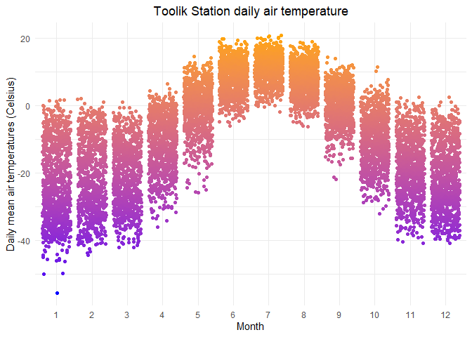

## Read in the Toolik Lake meteorologic data

**Data:** Shaver, G. 2019. A multi-year DAILY weather file for the Toolik Field Station at Toolik Lake, AK starting 1988 to present. ver 4. Environmental Data Initiative. https://doi.org/10.6073/pasta/ce0f300cdf87ec002909012abefd9c5c (Accessed 2021-08-08).

The data are stored in the `data-raw` subfolder. We'll use `here::here()` to point to it, and read it in using the `readr::read_csv()` function from the `readr` package (part of the `tidyverse`). 


```r
toolik_weather <- read_csv(here::here("data", "data-raw", "toolik_weather.csv"))
```


- First: Look at the data you've read in (always always)

- Second: What is that warning? `problems()` - line 6424

- How does R assign classes to data it reads in? See: https://readr.tidyverse.org/articles/readr.html

- Third: Are all missing values stored the same way? See: #N/A, and add a new argument within `readr`: na = "#N/A"


## Basic exploration


```r
# An overview:
skimr::skim(toolik_weather)
```


Table: Data summary

|                         |               |
|:------------------------|:--------------|
|Name                     |toolik_weather |
|Number of rows           |11171          |
|Number of columns        |21             |
|_______________________  |               |
|Column type frequency:   |               |
|character                |16             |
|logical                  |1              |
|numeric                  |4              |
|________________________ |               |
|Group variables          |None           |


**Variable type: character**

|skim_variable                   | n_missing| complete_rate| min| max| empty| n_unique| whitespace|
|:-------------------------------|---------:|-------------:|---:|---:|-----:|--------:|----------:|
|LTER_Site                       |         0|          1.00|   3|   3|     0|        1|          0|
|Station                         |         0|          1.00|   7|   7|     0|        1|          0|
|Flag_Daily_AirTemp_Mean_C       |      9861|          0.12|   1|   1|     0|        1|          0|
|Daily_AirTemp_AbsMax_C          |         0|          1.00|   3|   5|     0|      672|          0|
|Flag_Daily_AirTemp_AbsMax_C     |     10151|          0.09|   1|   1|     0|        1|          0|
|Daily_AirTemp_AbsMin_C          |         0|          1.00|   3|   5|     0|      601|          0|
|Flag_Daily_AirTemp_AbsMin_C     |      9935|          0.11|   1|   1|     0|        1|          0|
|Daily_Precip_Total_mm           |         0|          1.00|   3|   4|     0|      191|          0|
|Flag_Daily_Precip_Total_mm      |      8002|          0.28|   1|   1|     0|        1|          0|
|Daily_windsp_mean_msec          |         0|          1.00|   3|   4|     0|      115|          0|
|Daily_Windspeed_AbsMax_m_s      |         0|          1.00|   3|   4|     0|      193|          0|
|Daily_globalrad_total_jcm2      |      2190|          0.80|   1|   4|     0|     2164|          0|
|FLAG_Daily_globalrad_total_mjm2 |     11156|          0.00|   1|   1|     0|        1|          0|
|Moss                            |         1|          1.00|   1|   4|     0|       45|          0|
|Soil20cm                        |         1|          1.00|   1|   4|     0|       34|          0|
|Comments                        |      2247|          0.80|   1| 262|     0|       75|          0|


**Variable type: logical**

|skim_variable               | n_missing| complete_rate| mean|count |
|:---------------------------|---------:|-------------:|----:|:-----|
|FLAG_Daily_windsp_mean_msec |     11171|             0|  NaN|:     |


**Variable type: numeric**

|skim_variable        | n_missing| complete_rate|        mean|       sd|         p0|        p25|        p50|        p75|       p100|hist                                     |
|:--------------------|---------:|-------------:|-----------:|--------:|----------:|----------:|----------:|----------:|----------:|:----------------------------------------|
|Year                 |         0|             1|     2003.20|     8.83|     1988.0|     1996.0|     2003.0|     2011.0|     2018.0|▇▇▇▇▇ |
|Month                |         0|             1|        6.57|     3.44|        1.0|        4.0|        7.0|       10.0|       12.0|▇▅▅▅▇ |
|Date                 |         0|             1| 20032706.64| 88307.95| 19880601.0| 19960123.5| 20030916.0| 20110509.5| 20181231.0|▇▇▇▇▇ |
|Daily_AirTemp_Mean_C |         0|             1|       -8.20|    14.83|      -55.6|      -19.7|       -7.1|        4.4|       20.7|▁▃▆▇▆ |

```r
# A few other things to explore
dim(toolik_weather)
```

```
## [1] 11171    21
```

```r
names(toolik_weather)
```

```
##  [1] "Year"                            "Month"                          
##  [3] "Date"                            "LTER_Site"                      
##  [5] "Station"                         "Daily_AirTemp_Mean_C"           
##  [7] "Flag_Daily_AirTemp_Mean_C"       "Daily_AirTemp_AbsMax_C"         
##  [9] "Flag_Daily_AirTemp_AbsMax_C"     "Daily_AirTemp_AbsMin_C"         
## [11] "Flag_Daily_AirTemp_AbsMin_C"     "Daily_Precip_Total_mm"          
## [13] "Flag_Daily_Precip_Total_mm"      "Daily_windsp_mean_msec"         
## [15] "FLAG_Daily_windsp_mean_msec"     "Daily_Windspeed_AbsMax_m_s"     
## [17] "Daily_globalrad_total_jcm2"      "FLAG_Daily_globalrad_total_mjm2"
## [19] "Moss"                            "Soil20cm"                       
## [21] "Comments"
```

## One awesome cleaning tool: {janitor}

...and meet the pipe operator!

I don't want to deal with those capital letters. These aren't even bad looking column names, but let's clean them up a bit. 


```r
toolik_weather <- toolik_weather %>% clean_names() # What does this do? Say it in words.

# What is this %>% thing? Meet the pipe operator! Also, as of a couple months ago, |> is a native pipe operator (versus %>%, which comes along with the tidyverse)

# Now what are the column names?
```


```r
names(toolik_weather)
```

```
##  [1] "year"                            "month"                          
##  [3] "date"                            "lter_site"                      
##  [5] "station"                         "daily_air_temp_mean_c"          
##  [7] "flag_daily_air_temp_mean_c"      "daily_air_temp_abs_max_c"       
##  [9] "flag_daily_air_temp_abs_max_c"   "daily_air_temp_abs_min_c"       
## [11] "flag_daily_air_temp_abs_min_c"   "daily_precip_total_mm"          
## [13] "flag_daily_precip_total_mm"      "daily_windsp_mean_msec"         
## [15] "flag_daily_windsp_mean_msec"     "daily_windspeed_abs_max_m_s"    
## [17] "daily_globalrad_total_jcm2"      "flag_daily_globalrad_total_mjm2"
## [19] "moss"                            "soil20cm"                       
## [21] "comments"
```

## Make a graph

Let's make a jitterplot of temperatures by month. 


```r
toolik_temp_plot <- ggplot(data = toolik_weather, aes(x = as.factor(month), y = daily_air_temp_mean_c)) +
  geom_jitter(aes(color = daily_air_temp_mean_c), show.legend = FALSE) +
  scale_color_gradient(low = "blue", high = "orange") +
  theme_minimal()+
  theme(plot.title = element_text(hjust = 0.5))+
  labs(title = "Toolik Station daily air temperature",
       x = "Month",
       y = "Daily mean air temperatures (Celsius)")

toolik_temp_plot
```

<!-- -->

## Export a figure


```r
ggsave(here::here("figs", "toolik_temp_plot.png"), height = 6, width = 7)
```

Now try changing something about the ggplot code, and re-run your `ggsave()` line above. Does your saved figure change? Great! 

## End Example 1
