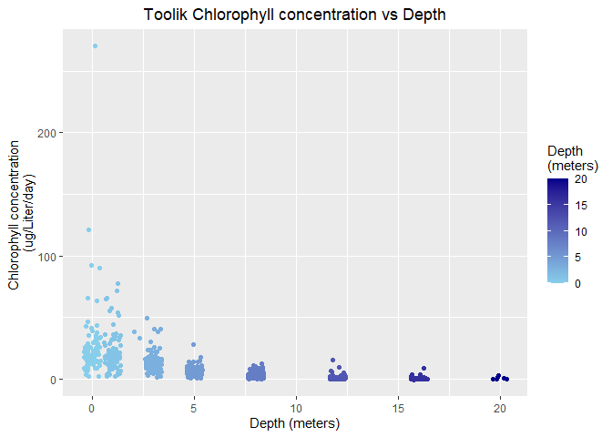

```r
toolik_chlorophyll <- read_csv(here::here("data", "data-raw", "toolik_chlorophyll.csv"))
```

```
## Rows: 745 Columns: 7
```

```
## -- Column specification --------------------------------------------------------
## Delimiter: ","
## chr (4): Lake, Date, Active chl a (ug/L), Pprod (mg available C/m3/d)
## dbl (3): Site Code, Depth, Julian Day
```

```
## 
## i Use `spec()` to retrieve the full column specification for this data.
## i Specify the column types or set `show_col_types = FALSE` to quiet this message.
```

```r
# summary
skim(toolik_chlorophyll)
```


Table: Data summary

|                         |                   |
|:------------------------|:------------------|
|Name                     |toolik_chlorophyll |
|Number of rows           |745                |
|Number of columns        |7                  |
|_______________________  |                   |
|Column type frequency:   |                   |
|character                |4                  |
|numeric                  |3                  |
|________________________ |                   |
|Group variables          |None               |


**Variable type: character**

|skim_variable               | n_missing| complete_rate| min| max| empty| n_unique| whitespace|
|:---------------------------|---------:|-------------:|---:|---:|-----:|--------:|----------:|
|Lake                        |         0|             1|   6|   6|     0|        1|          0|
|Date                        |         0|             1|   9|   9|     0|      103|          0|
|Active chl a (ug/L)         |         0|             1|   1|   8|     0|      138|          0|
|Pprod (mg available C/m3/d) |         0|             1|   1|   7|     0|      579|          0|


**Variable type: numeric**

|skim_variable | n_missing| complete_rate|     mean|      sd|    p0|   p25|   p50|   p75|  p100|hist                                     |
|:-------------|---------:|-------------:|--------:|-------:|-----:|-----:|-----:|-----:|-----:|:----------------------------------------|
|Site Code     |         0|             1|   100.00|    0.00|   100|   100|   100|   100|   100|▁▁▇▁▁ |
|Depth         |         0|             1|     6.56|    5.62|     0|     1|     5|    12|    20|▇▅▂▂▁ |
|Julian Day    |         0|             1| 81424.69| 4245.88| 75183| 77216| 80197| 85207| 88223|▇▇▁▆▆ |

```r
# clean up 
toolik_chlorophyll <- toolik_chlorophyll %>% clean_names()
toolik_chlorophyll
```

```
## # A tibble: 745 x 7
##    site_code lake   depth date      julian_day active_chl_a_ug~ pprod_mg_availa~
##        <dbl> <chr>  <dbl> <chr>          <dbl> <chr>            <chr>           
##  1       100 Toolik     0 02-Jul-75      75183 .                14.05           
##  2       100 Toolik     1 02-Jul-75      75183 .                12.45           
##  3       100 Toolik     3 02-Jul-75      75183 .                30.1            
##  4       100 Toolik     5 02-Jul-75      75183 .                9.5             
##  5       100 Toolik     8 02-Jul-75      75183 .                9.1             
##  6       100 Toolik    12 02-Jul-75      75183 .                15.33           
##  7       100 Toolik    16 02-Jul-75      75183 .                1.41            
##  8       100 Toolik     0 13-Jul-75      75194 .                2.05            
##  9       100 Toolik     1 13-Jul-75      75194 .                1.98            
## 10       100 Toolik     3 13-Jul-75      75194 .                2.48            
## # ... with 735 more rows
```

```r
toolik_chlorophyll$pprod_mg_available_c_m3_d <- as.numeric(toolik_chlorophyll$pprod_mg_available_c_m3_d)
```

```
## Warning: NAs introduced by coercion
```

```r
toolik_chlorophyll
```

```
## # A tibble: 745 x 7
##    site_code lake   depth date      julian_day active_chl_a_ug~ pprod_mg_availa~
##        <dbl> <chr>  <dbl> <chr>          <dbl> <chr>                       <dbl>
##  1       100 Toolik     0 02-Jul-75      75183 .                           14.0 
##  2       100 Toolik     1 02-Jul-75      75183 .                           12.4 
##  3       100 Toolik     3 02-Jul-75      75183 .                           30.1 
##  4       100 Toolik     5 02-Jul-75      75183 .                            9.5 
##  5       100 Toolik     8 02-Jul-75      75183 .                            9.1 
##  6       100 Toolik    12 02-Jul-75      75183 .                           15.3 
##  7       100 Toolik    16 02-Jul-75      75183 .                            1.41
##  8       100 Toolik     0 13-Jul-75      75194 .                            2.05
##  9       100 Toolik     1 13-Jul-75      75194 .                            1.98
## 10       100 Toolik     3 13-Jul-75      75194 .                            2.48
## # ... with 735 more rows
```

```r
toolik_depth_chloro_plot <- ggplot(data = toolik_chlorophyll, aes(x = depth, y = pprod_mg_available_c_m3_d)) +
  geom_jitter(aes(color = depth), show.legend = TRUE) +
  scale_color_gradient(low = "blue", high = "black") +
  theme_minimal()+
  theme(plot.title = element_text(hjust = 0.5))+
  labs(title = "Toolik Chlorophyll concentration (ug/Liter/day) vs Depth (meter)",
       x = "Depth (meters)",
       y = "Chlorophyll concentration \n(ug/Liter/day)")

toolik_depth_chloro_plot
```

```
## Warning: Removed 102 rows containing missing values (geom_point).
```

<!-- -->


